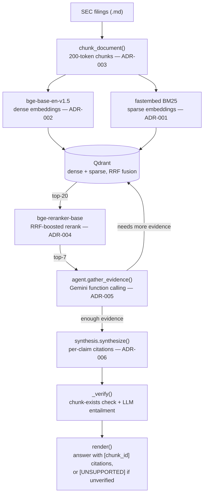

# Research Copilot

A scoped-down but architecturally real clone of what Perplexity/You.com charge $20/mo for:
cited, synthesized answers over a document corpus instead of a list of links.

**Stack:** Python · FastAPI · Qdrant (hybrid dense+sparse) · `bge-base-en-v1.5` +
`bge-reranker-base` (local, CPU) · Gemini function calling (+ Groq/OpenRouter/SambaNova/
Cerebras failover) · Docker Compose · vanilla JS UI

## Results (Week 1)

Eval corpus: 18 SEC filings (10-Ks + 10-Qs) for 6 regional banks, chosen specifically for
2023's regional-banking deposit-stress period — real version drift, dense financial
tables, and cross-company terminology collision, not a clean toy corpus. 40 hand-verified
questions across factual/numeric, multi-hop/cross-reference, and adversarial/unanswerable
buckets (`data/eval/questions_draft.md`).

| Stage | Metric | Result |
|---|---|---|
| Retrieval ablation (offline, no LLM) | Hit@1, dense-only → +hybrid (RRF) | 9.7% → 25.8% |
| Retrieval ablation, +reranking (old, pure cross-encoder) | Hit@1 / Hit@7 / MRR | 19.4% / 48.4% / 0.286 — **regressed Hit@1 and MRR**, see below |
| Retrieval ablation, +reranking (RRF-boosted, current — ADR-004) | Hit@1 / Hit@7 / MRR | **32.3% / 58.1% / 0.398** — reproducible, offline, no LLM involved |
| Citation verification (Gemini, clean single-provider, temperature=0) | Answerable correctly cited | 17/28 (60.7%) — **stale, see caveat below** |
| Citation verification (Gemini, clean single-provider, temperature=0) | Adversarial correctly abstained | 5/8 (62.5%) excluding 2 mis-designed questions — **stale, see caveat below** |

**Caveat (honest, not hidden):** the citation-verification numbers above were computed
*before* the RRF-boosted reranking fix (retrieval ablation numbers are current; citation
numbers are not). A full clean re-run against the current retrieval pipeline is the next
planned step — not yet done. Along the way, failure analysis (`eval/failure_analysis.py`)
found that of 6 "failing" cases inspected in full detail under the old pipeline, **zero
were confirmed real system bugs** — every one was an eval-construction artifact (ground
truth missing a valid alternate phrasing of the same fact; an abstention metric that
can't distinguish "cited evidence to fabricate" from "cited evidence to explain an
honest non-answer"; two adversarial questions whose assumed-absent data actually exists
in the text) or a bug in the diagnostic tool's own truncated evidence preview. An
LLM-based entailment check was added to `_verify()` as a general safety net regardless
(a cross-encoder reranker was tried first and rejected as an entailment checker — see
`KNOWN_TRADEOFFS.md`).

The retrieval-side regression above is itself a real, documented negative result: the
cross-encoder reranker alone *hurt* Hit@1 and MRR despite improving Hit@7, because it
scored all same-filing chunks in a compressed 0.94-1.0 band, making the top-N cutoff
effectively random among them. Fixed by RRF-boosted scoring (70% normalized cross-encoder
+ 30% RRF position bonus), which preserves the reranker's rescue ability while anchoring
to RRF ordering when scores are compressed — see ADR-004 and `KNOWN_TRADEOFFS.md`.

See `WEEKLY_LOG.md`'s failure-analysis and multi-provider-failover entries, plus
`KNOWN_TRADEOFFS.md`, for the full trail — including a multi-provider LLM failover
architecture (ADR-007) built along the way to route around Gemini's daily quota, which
surfaced its own real bugs in other providers' models before a fresh Gemini key turned
out to be the fastest path to a clean run.

## Architecture



**Detailed pipeline trace:**

```
SEC filings (data/sec_filings/*.md) or data/sample_docs/*.md
        │
        ▼
  chunk_document()          recursive/structure-aware splitter (ADR-003)
                             tuned to 200 tokens after a real ablation-driven fix
                             (500-token default diluted embeddings — see ADR-003 addendum)
        │
        ▼
 EmbeddingProvider.embed_documents()     local bge-base-en-v1.5, default (ADR-002)
 BM25SparseProvider.embed_documents()    fastembed BM25, local (ADR-001)
        │
        ▼
   Qdrant (dense + sparse, RRF fusion)   hybrid vector store (ADR-001)
        │
        ▼  query time (Retriever.search(), invoked by the agent loop below)
 EmbeddingProvider.embed_query() + BM25SparseProvider.embed_query()
        │
        ▼
   Qdrant.hybrid_search()   →  top-20 candidates  (dense-only / no-rerank toggles
                                available on Retriever for ablation testing)
        │
        ▼
 RerankerProvider.rerank()   local bge-reranker-base cross-encoder, default (ADR-004)
        │
        ▼
   top-5 reranked chunks, tagged with stable chunk_id ("source#chunk_index")
        │
        ▼
 agent.gather_evidence()     hand-rolled loop, Gemini native function calling (ADR-005)
   — model decides whether/what/when to call `search`, loop accumulates evidence
     across calls until the model signals it's ready to answer or hits the iteration cap
        │
        ▼
 synthesis.synthesize()      structured per-claim citation schema (ADR-006)
   — model returns {"claims": [{"text", "source_chunk_ids"}]}
   — _verify() checks every cited ID exists in retrieved evidence, THEN runs a
     batched LLM entailment check (does the chunk's text actually state the
     claimed fact — a reranker was tried first and rejected, see KNOWN_TRADEOFFS.md)
     claims with no valid, entailed citation are flagged, not silently dropped
        │
        ▼
 synthesis.render()          plain-text answer with inline [chunk_id] citations
                              or [UNSUPPORTED — no citation] markers
```

Every provider (embedding, sparse, reranker) sits behind a small interface
(`embeddings/base.py`, `reranker/base.py`) selected via `.env` config
(`EMBEDDING_PROVIDER`, `RERANKER_PROVIDER`) — swapping backends is a config change,
not a refactor. Gemini calls (agent loop + synthesis) go through `retry.py`'s
exponential backoff for per-minute rate limits and transient 504s, with fail-fast
detection of the (unrecoverable) daily quota.

## Eval harness

```
src/research_copilot/eval/
  ground_truth.py           40 hand-verified questions, each resolved to a real chunk_id
                             by re-chunking source files and locating a verbatim quote
  retrieval_ablation.py     Hit@1/Hit@5/MRR across dense-only / +hybrid / +hybrid+rerank
                             (fully offline — no LLM calls)
  citation_verification.py  runs the full agent loop + synthesis per question, checks
                             citation correctness (answerable) and abstention (adversarial)
                             (the only Gemini-dependent eval stage)
  failure_analysis.py       captures full retrieved-evidence + raw-claims detail for a
                             specific question, to localize whether a failure is in
                             retrieval, synthesis, or verification
```

```bash
# offline, no Gemini quota used
python -m research_copilot.eval.ground_truth
python -m research_copilot.eval.retrieval_ablation

# Gemini-dependent — pass specific question IDs to control quota usage
python -c "from research_copilot.eval.citation_verification import run, print_summary; \
  print_summary(run(question_ids=[1,2,31,32]))"
```

## UI

A walking-skeleton web UI (ADR-008): FastAPI backend wrapping the existing agent loop +
citation synthesis, served alongside a static HTML/JS page (no build step, no Node).
Answers render as discrete claims with clickable citation badges — clicking one shows
the actual source chunk text, so a citation can be independently checked, not just
trusted. Unsupported claims render with a distinct `[UNSUPPORTED — no citation]` badge
rather than being hidden. A telemetry panel shows per-query cost/latency (see below).
Verified end-to-end in a real browser: a golden-path question (WAL total deposits)
returned a correctly-cited answer with working source lookup, and an out-of-corpus
question (SVB) correctly rendered the unsupported badge instead of fabricating an answer.

```bash
export PYTHONPATH=src
uvicorn research_copilot.api:app --reload   # http://localhost:8000
```

**Deferred (see ADR-008):** no true token-by-token streaming yet (`synthesize()` still
uses a blocking call — a full answer appears at once after a 10-30s wait, not
progressively); no React/Next.js upgrade yet (CLAUDE.md's originally suggested stack,
explicitly planned as a later layer once this API-first version proved out).

## What's NOT here yet (next layers, per CLAUDE.md's incremental-build rule)

- Real token-by-token streaming (ADR-008) and a React/Next.js frontend upgrade
- An explicit "unable_to_answer" field in the synthesis schema, so abstention doesn't
  have to be inferred from an empty citation list (currently conflates "fabricated a
  claim" with "honestly explained it couldn't answer" — see KNOWN_TRADEOFFS.md)
- Correcting `ADVERSARIAL_QUESTIONS`: Q31 and Q38 turned out to be answerable after all
  (their assumed-absent data actually exists in text) — still marked adversarial
- SambaNova and Cerebras (ADR-007's multi-provider failover) are wired into the provider
  registry but completely untested — Groq and OpenRouter both needed real fixes/model
  swaps before working reliably, so assume these two need the same before trusting them
- Contextual Retrieval upgrade (ADR-003 — Parent-Child chunking was tried and rejected
  after mixed/regressive results on a 3-company test; Contextual Retrieval remains
  untried, blocked mainly by its per-chunk LLM ingestion cost at full corpus scale)
- Semantic cache
- Tests (unit/integration/eval-based), CI/CD, Dockerfile, and an actual deployment —
  the cross-cutting bar's remaining items, see `KNOWN_TRADEOFFS.md`
- A full clean citation-verification re-run against the current RRF-boosted retrieval
  pipeline (the numbers above predate that fix — see the caveat in Results)

## Setup

```bash
python3 -m venv .venv
source .venv/bin/activate
pip install torch --index-url https://download.pytorch.org/whl/cpu  # CPU-only, avoids ~1.5GB of unneeded CUDA packages
pip install -r requirements.txt

docker compose up -d   # starts Qdrant on :6333

cp .env.example .env   # defaults to local_bge + local_cross_encoder
# set GEMINI_API_KEY in .env — required for the agent loop and citation synthesis
# (not required for raw retrieval via research_copilot.query)
```

## Run

```bash
export PYTHONPATH=src
python -m research_copilot.ingest data/sample_docs   # chunk + embed + upsert into Qdrant
# or: python -m research_copilot.ingest data/sec_filings sec_filings_banks_chunk200

python -m research_copilot.query "your question here"    # raw retrieval, no LLM call
python -m research_copilot.answer "your question here"    # full agentic loop + cited answer
```

First run downloads the local models (`bge-base-en-v1.5`, `bge-reranker-base`,
fastembed's BM25 model) — expect a one-time delay.

## Cost

$0 for retrieval (local embeddings, local reranker, Qdrant in Docker). The agent loop and
citation synthesis use Gemini's free tier — note its **daily** quota (not just per-minute)
is easy to exhaust while testing; see `KNOWN_TRADEOFFS.md`. Every LLM call (ADR-009) is
logged to `data/telemetry/calls.jsonl` with provider, model, tokens in/out, latency, and
computed cost, surfaced per-query and in aggregate in the UI — a real query end-to-end
(WAL deposits, 9 LLM calls) measured $0.000613 and 115.7s wall-clock on a slow Gemini
free-tier day. A "cost for 1,000 users/month" model is not yet written up — next on the
cross-cutting-bar list.

## Interview prep

`docs/interview_prep/` — 50 scenario-based questions (and full detailed answers) across
12 topics, generated from this project's actual ADRs, real ablation numbers, and real
bugs found and fixed. Two PDFs: `Research_Copilot_Interview_Questions.pdf` and
`Research_Copilot_Interview_Answers.pdf`.
