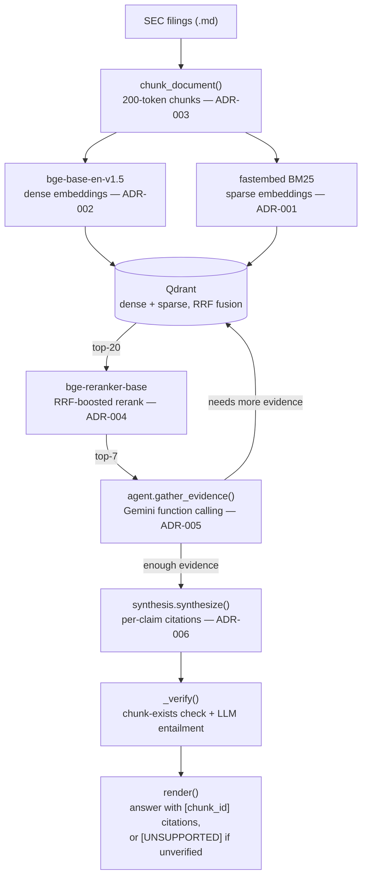

# Research Copilot

A scoped-down but architecturally real clone of what Perplexity/You.com charge $20/mo for:
cited, synthesized answers over a document corpus instead of a list of links.

**Stack:** Python · FastAPI · Qdrant (hybrid dense+sparse) · `bge-base-en-v1.5` +
`bge-reranker-base` (local, CPU) · Gemini function calling (+ Groq/OpenRouter/SambaNova/
Cerebras failover) · Docker Compose · vanilla JS UI

## Results (Week 1)

Eval corpus: 18 SEC filings (10-Ks + 10-Qs) for 6 regional banks, chosen specifically for
2023's regional-banking deposit-stress period — real version drift, dense financial
tables, and cross-company terminology collision, not a clean toy corpus. 40 hand-verified
questions across factual/numeric, multi-hop/cross-reference, and adversarial/unanswerable
buckets (`data/eval/questions_draft.md`).

| Metric (offline retrieval ablation, no LLM calls, reproducible) | Result |
|---|---|
| Hit@1 | **32.3%** (vs. 9.7% dense-only baseline) |
| Hit@7 | **58.1%** |
| MRR | **0.398** |

Reached with hybrid dense+sparse retrieval (RRF fusion) plus a cross-encoder reranker.
Tuning the reranker surfaced a real regression along the way — a naive cross-encoder
pass *hurt* Hit@1 and MRR despite improving Hit@7, because same-filing chunks scored in
a compressed 0.94-1.0 band, making the top-N cutoff effectively random. Diagnosed and
fixed with RRF-boosted scoring (70% normalized cross-encoder + 30% RRF position bonus —
ADR-004), which preserves the reranker's rescue ability while anchoring to RRF ordering
when scores are compressed.

End-to-end citation accuracy (full agent loop + synthesis, Gemini), clean re-run against
the current RRF-boosted retrieval pipeline, single provider, no failover needed:
**19/31 (61.3%) answerable questions correctly cited**, **7/8 (87.5%) adversarial
questions correctly abstained** — up sharply from 62.5% on the previous pipeline. Raw
results in `data/eval/citation_verification_rrf_boosted.json`. On the prior baseline,
failure analysis (`eval/failure_analysis.py`) on 6 "failing" cases found zero confirmed
system bugs — each was an eval-construction artifact (ground truth missing a valid
alternate phrasing; an abstention metric that couldn't distinguish "cited evidence to
fabricate" from "cited evidence to explain an honest non-answer"; adversarial questions
whose assumed-absent data actually existed in the text). That same case-by-case audit
hasn't been re-run against this new baseline yet, so the 61.3%/87.5% numbers likely
still undercount true accuracy for the same reasons, just not yet individually
re-verified — see `KNOWN_TRADEOFFS.md`. An LLM-based entailment check was added to
`_verify()` as a general safety net regardless.

See `ADR-004`, `WEEKLY_LOG.md`, and `KNOWN_TRADEOFFS.md` for the full decision and
debugging trail — including a multi-provider LLM failover architecture (ADR-007) built
to route around Gemini's free-tier daily quota.

## Architecture



**Detailed pipeline trace:**

```
SEC filings (data/sec_filings/*.md) or data/sample_docs/*.md
        │
        ▼
  chunk_document()          recursive/structure-aware splitter (ADR-003)
                             tuned to 200 tokens after a real ablation-driven fix
                             (500-token default diluted embeddings — see ADR-003 addendum)
        │
        ▼
 EmbeddingProvider.embed_documents()     local bge-base-en-v1.5, default (ADR-002)
 BM25SparseProvider.embed_documents()    fastembed BM25, local (ADR-001)
        │
        ▼
   Qdrant (dense + sparse, RRF fusion)   hybrid vector store (ADR-001)
        │
        ▼  query time (Retriever.search(), invoked by the agent loop below)
 EmbeddingProvider.embed_query() + BM25SparseProvider.embed_query()
        │
        ▼
   Qdrant.hybrid_search()   →  top-20 candidates  (dense-only / no-rerank toggles
                                available on Retriever for ablation testing)
        │
        ▼
 RerankerProvider.rerank()   local bge-reranker-base cross-encoder, default (ADR-004)
        │
        ▼
   top-5 reranked chunks, tagged with stable chunk_id ("source#chunk_index")
        │
        ▼
 agent.gather_evidence()     hand-rolled loop, Gemini native function calling (ADR-005)
   — model decides whether/what/when to call `search`, loop accumulates evidence
     across calls until the model signals it's ready to answer or hits the iteration cap
        │
        ▼
 synthesis.synthesize()      structured per-claim citation schema (ADR-006)
   — model returns {"claims": [{"text", "source_chunk_ids"}]}
   — _verify() checks every cited ID exists in retrieved evidence, THEN runs a
     batched LLM entailment check (does the chunk's text actually state the
     claimed fact — a reranker was tried first and rejected, see KNOWN_TRADEOFFS.md)
     claims with no valid, entailed citation are flagged, not silently dropped
        │
        ▼
 synthesis.render()          plain-text answer with inline [chunk_id] citations
                              or [UNSUPPORTED — no citation] markers
```

Every provider (embedding, sparse, reranker) sits behind a small interface
(`embeddings/base.py`, `reranker/base.py`) selected via `.env` config
(`EMBEDDING_PROVIDER`, `RERANKER_PROVIDER`) — swapping backends is a config change,
not a refactor. Gemini calls (agent loop + synthesis) go through `retry.py`'s
exponential backoff for per-minute rate limits and transient 504s, with fail-fast
detection of the (unrecoverable) daily quota.

## Eval harness

```
src/research_copilot/eval/
  ground_truth.py           40 hand-verified questions, each resolved to a real chunk_id
                             by re-chunking source files and locating a verbatim quote
  retrieval_ablation.py     Hit@1/Hit@5/MRR across dense-only / +hybrid / +hybrid+rerank
                             (fully offline — no LLM calls)
  citation_verification.py  runs the full agent loop + synthesis per question, checks
                             citation correctness (answerable) and abstention (adversarial)
                             (the only Gemini-dependent eval stage)
  failure_analysis.py       captures full retrieved-evidence + raw-claims detail for a
                             specific question, to localize whether a failure is in
                             retrieval, synthesis, or verification
```

```bash
# offline, no Gemini quota used
python -m research_copilot.eval.ground_truth
python -m research_copilot.eval.retrieval_ablation

# Gemini-dependent — pass specific question IDs to control quota usage
python -c "from research_copilot.eval.citation_verification import run, print_summary; \
  print_summary(run(question_ids=[1,2,31,32]))"
```

## UI

A walking-skeleton web UI (ADR-008): FastAPI backend wrapping the existing agent loop +
citation synthesis, served alongside a static HTML/JS page (no build step, no Node).
Answers render as discrete claims with clickable citation badges — clicking one shows
the actual source chunk text, so a citation can be independently checked, not just
trusted. Unsupported claims render with a distinct `[UNSUPPORTED — no citation]` badge
rather than being hidden. A telemetry panel shows per-query cost/latency (see below).
Verified end-to-end in a real browser: a golden-path question (WAL total deposits)
returned a correctly-cited answer with working source lookup, and an out-of-corpus
question (SVB) correctly rendered the unsupported badge instead of fabricating an answer.

```bash
export PYTHONPATH=src
uvicorn research_copilot.api:app --reload   # http://localhost:8000
```

**Deferred (see ADR-008):** no true token-by-token streaming yet (`synthesize()` still
uses a blocking call — a full answer appears at once after a 10-30s wait, not
progressively); no React/Next.js upgrade yet (explicitly planned as a later layer once
this API-first version proved out).

## Roadmap (next layers, built incrementally)

- Case-by-case failure audit of the current citation-verification baseline (same rigor
  applied to the previous baseline — see the note in Results)
- Real token-by-token streaming and a React/Next.js frontend upgrade
- Semantic cache for repeated/similar queries
- Contextual Retrieval upgrade (Parent-Child chunking was tried and rejected after
  mixed/regressive results — see `KNOWN_TRADEOFFS.md`)
- Integration and eval-based tests (unit tests covering pure logic exist — see Testing
  below), and a live deployment — the remaining cross-cutting-bar items

Full granular tradeoffs and known gaps (provider coverage, eval-set corrections, schema
edge cases, etc.) are tracked honestly in `KNOWN_TRADEOFFS.md` rather than glossed over.

## Setup

```bash
python3 -m venv .venv
source .venv/bin/activate
pip install torch --extra-index-url https://download.pytorch.org/whl/cpu  # CPU-only, avoids ~1.5GB of unneeded CUDA packages
pip install -r requirements.txt

docker compose up -d   # starts Qdrant on :6333

cp .env.example .env   # defaults to local_bge + local_cross_encoder
# set GEMINI_API_KEY in .env — required for the agent loop and citation synthesis
# (not required for raw retrieval via research_copilot.query)
```

Or run the whole stack (API + Qdrant) in Docker instead of a local venv:

```bash
docker compose up -d --build   # API on :8000, Qdrant on :6333
```

## Run

```bash
export PYTHONPATH=src
python -m research_copilot.ingest data/sample_docs   # chunk + embed + upsert into Qdrant
# or: python -m research_copilot.ingest data/sec_filings sec_filings_banks_chunk200

python -m research_copilot.query "your question here"    # raw retrieval, no LLM call
python -m research_copilot.answer "your question here"    # full agentic loop + cited answer
```

First run downloads the local models (`bge-base-en-v1.5`, `bge-reranker-base`,
fastembed's BM25 model) — expect a one-time delay.

## Testing

```bash
pip install -r requirements-dev.txt
pytest -v
```

23 unit tests covering the pure-logic surfaces (chunking boundaries, the RRF-boosted
rerank math, `retry.py`'s backoff/quota-detection branches, `synthesis._verify()`'s
citation-existence and entailment-batching logic) — no live Qdrant or API calls needed,
runs in under a second. Wired into GitHub Actions on every push/PR
(`.github/workflows/tests.yml`). Integration tests (against a real Qdrant) and
eval-based tests (wiring the eval harness into CI) are still open — see Roadmap.

## Cost

$0 for retrieval — local embeddings, local reranker, Qdrant in Docker. The agent loop and
citation synthesis run on free-tier LLM APIs (Gemini primary, 4-provider failover — see
ADR-007). Every call (ADR-009) is logged with provider, model, tokens in/out, latency, and
computed cost to `data/telemetry/calls.jsonl`, surfaced per-query and in aggregate in the
UI — a real end-to-end query (9 LLM calls across the agent loop + synthesis) came in at
**$0.000613**. Free-tier latency varies with provider load (see `KNOWN_TRADEOFFS.md` for
details); a cost model against paid-tier pricing at 1,000 users/month is not yet written
up — next on the roadmap.
